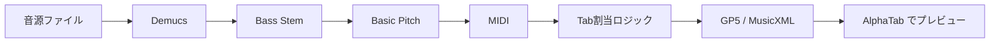

# Stem2Tab

音源ファイルからベースラインを抽出し、Tab譜（Guitar Pro / MusicXML）を自動生成するWebアプリケーション。

## 概要



## プロジェクト構造

```
Stem2Tab/
├── docker-compose.yml         # GPU版（標準）
├── docker-compose.cpu.yml     # CPU版
├── .env.example               # 環境変数テンプレート
├── backend/                   # Python バックエンド
│   ├── Dockerfile
│   ├── pyproject.toml         # uv 用
│   ├── src/
│   │   ├── api/               # FastAPI ルート
│   │   ├── pipelines/         # Demucs, Basic Pitch の呼び出し
│   │   ├── logic/             # Tab割当アルゴリズム
│   │   └── core/              # 設定、ログ
│   └── tests/
├── frontend/                  # React フロントエンド
│   ├── Dockerfile
│   ├── package.json
│   └── src/
│       ├── components/        # AlphaTab, Fretboard 等
│       ├── hooks/
│       └── pages/
├── docs/                      # ドキュメント
├── data/                      # 成果物保存先 (gitignore)
└── .agent/                    # AIエージェント用ルール
    └── workflows/
```

## 技術スタック

| レイヤー | 技術 |
|:---|:---|
| **音源分離** | [Demucs](https://github.com/facebookresearch/demucs) (Hybrid Transformer v4) |
| **Audio-to-MIDI** | [Basic Pitch](https://github.com/spotify/basic-pitch) (ONNX) |
| **Tab生成** | [PyGuitarPro](https://pyguitarpro.readthedocs.io/), [music21](https://web.mit.edu/music21/doc/) |
| **バックエンド** | FastAPI + Celery + Redis |
| **フロントエンド** | React + Vite + [AlphaTab](https://alphatab.net/) |
| **パッケージ管理** | [uv](https://docs.astral.sh/uv/) |

## クイックスタート

```bash
# リポジトリをクローン
git clone https://github.com/your-repo/Stem2Tab.git
cd Stem2Tab

# 環境変数の設定
cp .env.example .env

# Docker Compose で起動 (GPU版)
docker compose up --build

# CPUのみの場合
docker compose -f docker-compose.cpu.yml up --build

# ブラウザでアクセス
open http://localhost:5173
```

> [!NOTE]
> GPUを使用する場合は NVIDIA Container Toolkit が必要です。
> 詳細は [INFRASTRUCTURE.md](docs/INFRASTRUCTURE.md) を参照してください。

## ドキュメント

| ドキュメント | 内容 |
|:---|:---|
| [ARCHITECTURE.md](docs/ARCHITECTURE.md) | システム構成、コンポーネント、デプロイ |
| [DATAFLOW.md](docs/DATAFLOW.md) | パイプライン処理、ジョブ状態管理 |
| [FEATURES.md](docs/FEATURES.md) | 機能一覧、Phase別ロードマップ |
| [IMPLEMENTATION.md](docs/IMPLEMENTATION.md) | 実装計画、依存関係、環境変数 |
| [DEPENDENCIES.md](docs/DEPENDENCIES.md) | 外部ライブラリ、モデル管理、互換性 |
| [TESTING.md](docs/TESTING.md) | テスト戦略、CI/CD |
| [DEMO_MODE.md](docs/DEMO_MODE.md) | 演奏デモモード機能仕様 |
| [TECH_RESEARCH.md](docs/TECH_RESEARCH.md) | 技術スタック調査レポート |
| [INFRASTRUCTURE.md](docs/INFRASTRUCTURE.md) | **Docker Compose, Dockerfile, 環境変数** |
| [DEVELOPMENT_RULES.md](docs/DEVELOPMENT_RULES.md) | 開発・テスト・コーディングルール |

## 開発

### 環境構築

```bash
# バックエンド
cd backend
uv sync

# フロントエンド
cd frontend
npm install
```

### ローカル実行

```bash
# バックエンド (開発サーバー)
cd backend
uv run uvicorn app.main:app --reload

# フロントエンド (開発サーバー)
cd frontend
npm run dev
```

### テスト

```bash
# バックエンド
cd backend
uv run pytest

# フロントエンド
cd frontend
npm test
```

## ライセンス

MIT License

## 参考リンク

- [Demucs GitHub](https://github.com/facebookresearch/demucs)
- [Basic Pitch GitHub](https://github.com/spotify/basic-pitch)
- [PyGuitarPro Documentation](https://pyguitarpro.readthedocs.io/)
- [AlphaTab Documentation](https://alphatab.net/docs/introduction/)
- [Docker GPU Support](https://docs.docker.com/compose/how-tos/gpu-support/)
- [NVIDIA Container Toolkit](https://docs.nvidia.com/datacenter/cloud-native/container-toolkit/latest/install-guide.html)
