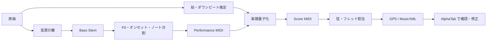

# Stem2Tab

音源ファイルからベースラインを抽出し、修正可能なMIDIとTab譜（Guitar Pro / MusicXML）を生成するWebアプリケーション。

## 概要


```mermaid
flowchart LR
    A[原曲] --> B[音源分離]
    A --> C[拍・ダウンビート推定]
    B --> D[Bass Stem]
    D --> E[F0・オンセット・ノート分割]
    E --> F[Performance MIDI]
    C --> G[楽譜量子化]
    F --> G
    G --> H[Score MIDI]
    H --> I[弦・フレット割当]
    I --> J[GP5 / MusicXML]
    J --> K[AlphaTab で確認・修正]
```

既存のDemucs→Basic Pitch→GP5/MusicXML処理はWebフローを検証するためのベースラインです。
現在の最優先事項は採譜品質を測定・比較できる評価基盤であり、実装順序は
[開発ロードマップ](docs/ROADMAP.md) と [Issue #1](https://github.com/tehutahu/Stem2Tab/issues/1)
を正本とします。

## プロジェクト構造

```
Stem2Tab/
├── docker-compose.yml         # GPU版（標準）
├── docker-compose.cpu.yml     # CPU版
├── .env.example               # 環境変数テンプレート
├── backend/                   # Python バックエンド
│   ├── Dockerfile
│   ├── pyproject.toml         # uv 用
│   ├── src/
│   │   ├── api/               # FastAPI ルート
│   │   ├── evaluation/        # 採譜ベンチマーク、共通ノート、評価指標
│   │   ├── pipelines/         # 現行の分離、採譜、Tab出力
│   │   ├── worker/            # Celeryタスク
│   │   └── core/              # 設定、ログ
│   └── tests/
├── frontend/                  # React フロントエンド
│   ├── Dockerfile
│   ├── package.json
│   └── src/
│       ├── components/        # AlphaTab, Fretboard 等
│       ├── hooks/
│       └── pages/
├── docs/                      # ドキュメント
├── data/                      # 成果物保存先 (gitignore)
└── AGENTS.md                  # AIエージェント用ルール
```

## 技術スタック

| レイヤー | 技術 |
|:---|:---|
| **音源分離** | [Demucs](https://github.com/facebookresearch/demucs) (Hybrid Transformer v4) |
| **採譜ベースライン** | [Basic Pitch](https://github.com/spotify/basic-pitch) (ONNX)。今後F0方式と比較 |
| **Tab生成** | [PyGuitarPro](https://pyguitarpro.readthedocs.io/), [music21](https://web.mit.edu/music21/doc/) |
| **バックエンド** | FastAPI + Celery + Redis |
| **フロントエンド** | React + Vite + [AlphaTab](https://alphatab.net/) |
| **パッケージ管理** | [uv](https://docs.astral.sh/uv/) |

## 前提環境と確認方法

- OS: Ubuntu 22.04+/24.04（WSL可）
- Docker: 29+（`docker --version`）
- Docker Compose: v2（`docker compose version`）
- Python: 3.11+（`python3 --version`） ※パッケージは必ず uv を使用
- uv: `uv --version`（未導入なら `curl -LsSf https://astral.sh/uv/install.sh | sh`）
- Node.js: 20.19+ または 22.12+（`node -v`）, npm: `npm -v`
- Git: `git --version`
- GPU 利用時: NVIDIA ドライバ + NVIDIA Container Toolkit（`nvidia-smi` がホストで動作し、下記コンテナ確認が通ること）

動作確認コマンド例:

```bash
python3 --version
uv --version
node -v && npm -v
docker --version && docker compose version
nvidia-smi  # GPUマシンのみ
docker run --rm --gpus all nvidia/cuda:11.8.0-base-ubuntu22.04 nvidia-smi  # GPUパススルー確認
```

## クイックスタート

```bash
# リポジトリをクローン
git clone https://github.com/tehutahu/Stem2Tab.git
cd Stem2Tab

# 環境変数の設定
cp .env.example .env

# Docker Compose で起動 (GPU版)
docker compose up --build

# CPUのみの場合
docker compose -f docker-compose.cpu.yml up --build

# ブラウザでアクセス
open http://localhost:5173
```

> [!NOTE]
> GPUを使用する場合は NVIDIA Container Toolkit が必要です。
> 詳細は [INFRASTRUCTURE.md](docs/INFRASTRUCTURE.md) を参照してください。

## ドキュメント

| ドキュメント | 内容 |
|:---|:---|
| [ROADMAP.md](docs/ROADMAP.md) | **現在の実装優先順位、評価データの判断事項** |
| [ARCHITECTURE.md](docs/ARCHITECTURE.md) | システム構成、コンポーネント、デプロイ |
| [DATAFLOW.md](docs/DATAFLOW.md) | パイプライン処理、ジョブ状態管理 |
| [FEATURES.md](docs/FEATURES.md) | 機能一覧、Phase別ロードマップ |
| [IMPLEMENTATION.md](docs/IMPLEMENTATION.md) | 実装計画、依存関係、環境変数 |
| [DEPENDENCIES.md](docs/DEPENDENCIES.md) | 外部ライブラリ、モデル管理、互換性 |
| [TESTING.md](docs/TESTING.md) | テスト戦略、CI/CD |
| [DEMO_MODE.md](docs/DEMO_MODE.md) | 演奏デモモード機能仕様 |
| [TECH_RESEARCH.md](docs/TECH_RESEARCH.md) | 技術スタック調査レポート |
| [INFRASTRUCTURE.md](docs/INFRASTRUCTURE.md) | **Docker Compose, Dockerfile, 環境変数** |
| [DEVELOPMENT_RULES.md](docs/DEVELOPMENT_RULES.md) | 開発・テスト・コーディングルール |

## 開発

### 環境構築

```bash
# バックエンド
cd backend
uv sync

# フロントエンド
cd frontend
npm install
```

### ローカル実行

```bash
# バックエンド (開発サーバー)
cd backend
uv run uvicorn src.api.main:app --reload

# フロントエンド (開発サーバー)
cd frontend
npm run dev
```

### 採譜ベンチマークCLI

> [!IMPORTANT]
> 現時点で、このプロジェクトには信頼できる正解MIDIがありません。まず生成されたBass Stemと
> MIDIを耳で比較し、採用候補を絞ります。正解MIDIは将来入手・作成できた場合だけ使用します。

楽曲を既存Basic Pitch経路で処理し、聴感比較用のMIDIとノートイベントを生成できます。
既定では音源分離を行わず、音声を直接Basic Pitchへ渡します。

```bash
cd backend
uv sync --locked --dev
./scripts/install_basic_pitch.sh

uv run python -m src.evaluation.benchmark \
  --audio /path/to/song.wav
```

既存Demucsとの比較を含める場合:

```bash
uv run python -m src.evaluation.benchmark \
  --audio /path/to/song.wav \
  --separators direct,demucs \
  --demucs-model htdemucs \
  --demucs-cache-dir ../data/cache/demucs
```

将来、Bass専用の正解MIDIを入手または作成できた場合は `--reference` を追加すると、
onset/onset+offset/frame F1、過剰・欠落ノート、オクターブ誤り等も計算します。正解MIDI内の
全非ドラムトラックは1つのBassパートとして統合します。

```bash
uv run python -m src.evaluation.benchmark \
  --audio /path/to/song.wav \
  --reference /path/to/reference.mid
```

成果物は既定で `benchmark_results/<音源名>-<UTC時刻>/` に保存されます。各条件の生MIDI、
共通ノートイベントJSON/CSV、Performance MIDI、`report.md`、比較用JSON/CSV、実行環境を
記録したmanifestが生成されます。正解MIDIなしの場合、正解依存の指標は空欄になります。
`--output-dir`を指定した場合、既存ファイルを誤って混在させないため、出力先は新規または
空のディレクトリである必要があります。

### テスト

```bash
# バックエンド
cd backend
uv run pytest

# フロントエンド
cd frontend
npm test -- --run
```

## ライセンス

MIT License

## 参考リンク

- [Demucs GitHub](https://github.com/facebookresearch/demucs)
- [Basic Pitch GitHub](https://github.com/spotify/basic-pitch)
- [PyGuitarPro Documentation](https://pyguitarpro.readthedocs.io/)
- [AlphaTab Documentation](https://alphatab.net/docs/introduction/)
- [Docker GPU Support](https://docs.docker.com/compose/how-tos/gpu-support/)
- [NVIDIA Container Toolkit](https://docs.nvidia.com/datacenter/cloud-native/container-toolkit/latest/install-guide.html)
