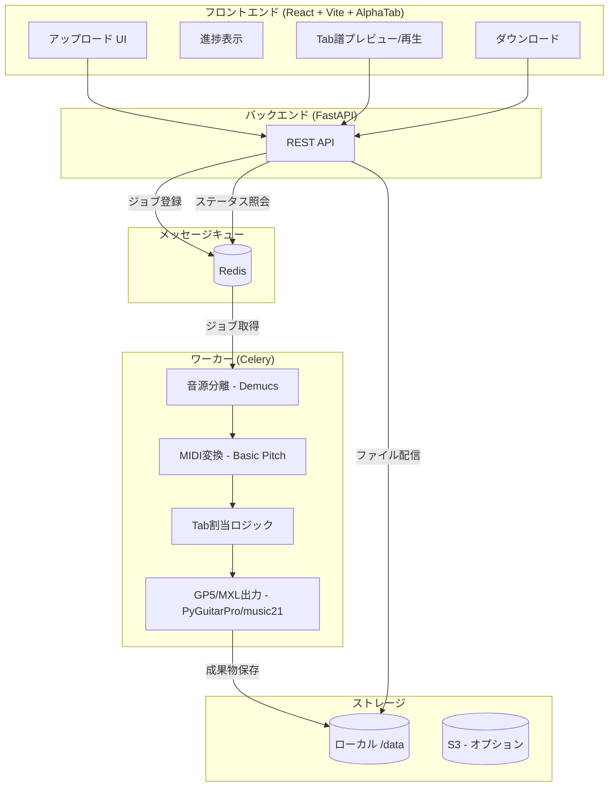

# アーキテクチャ

## 概要

本プロジェクトは、音源ファイル（mp3/wav等）からベースラインを抽出し、Tab譜（GP5/MusicXML）を自動生成、Webブラウザでプレビュー・編集・ダウンロードを行うためのアプリケーションです。

## モジュール構成

アプリケーションは **3つの独立したモジュール** で構成されます。

| モジュール | 実行環境 | 入力 | 出力 | 依存 |
|:---|:---|:---|:---|:---|
| **① Tab譜生成** | Backend (Celery) | 音源ファイル | GP5, MIDI | Demucs, Basic Pitch |
| **② Tab譜ビューア/デモ** | Frontend | GP5/MXL | - | AlphaTab |
| **③ Tab譜編集** | Frontend | GP5/MXL | GP5/MXL | AlphaTab (将来) |

> [!IMPORTANT]
> **モジュール分離の原則**
>
> - 各モジュールは疋結合であり、単独でも動作可能
> - ②③ は GP5/MXL ファイルがあれば動作（音源なしでもOK）
> - 既存の GP5 をアップロードしてデモモードで再生することも可能

## ゴール

- 音源をアップロードすると、Bass 向けに MIDI/TAB が生成され、プレビュー・ダウンロードできるフローを提供する。
- GPU を標準動作とし、CPU を推奨オプションとする
- 成果物はローカルストレージ (`/data`) を基本とし、S3 等はオプションで併用可能にする。

## システム構成図



## コンポーネント

| コンポーネント | 技術 | 責務 |
|:---|:---|:---|
| **Web Frontend** | React, Vite, TypeScript, AlphaTab | アップロード、進捗表示、譜面プレビュー/再生、ダウンロード |
| **API** | FastAPI | ファイル受領、ジョブ生成、状態照会、成果物配布 |
| **Worker** | Celery | Demucs/Basic Pitch/Tab割当の非同期実行 |
| **Broker/Backend** | Redis | Celeryのキューと結果ストア |
| **Storage** | ローカル `/data` (S3はオプション) | 元音源、stem、MIDI、GP5等の保存 |

## デプロイ構成 (Docker Compose)

| サービス | ポート | GPU |
|:---|:---|:---|
| `api` | 8000 | 任意 |
| `worker` | - | 推奨 |
| `redis` | 6379 | 不要 |
| `web` | 5173 | 不要 |

### GPU オプション

`docker-compose.yml` の `deploy.resources.devices` に以下を設定すると GPU を利用します（ホストには NVIDIA Container Toolkit が必要）。

```yaml
deploy:
  resources:
    reservations:
      devices:
        - driver: nvidia
          count: 1
          capabilities: [gpu]
```

### 環境変数

| 変数名 | 説明 | デフォルト |
|:---|:---|:---|
| `FILE_BUCKET_PATH` | 成果物の保存先 | `/data` |
| `CELERY_BROKER_URL` | RedisブローカーURL | `redis://redis:6379/0` |
| `STORAGE_PROVIDER` | `local` または `s3` | `local` |

## 信頼性とセキュリティ

- **非同期実行**: Celery + Redis でタイムアウトを回避。
- **ジョブ分離**: ジョブIDごとにディレクトリを分離。
- **資格情報管理**: `.env` で管理し、Gitには含めない。
- **サイズ制限**: API側でアップロードサイズを制限（推奨: 50MB以下）。
- **構造化ログ**: `job_id` を含め、処理時間・エラーを記録。
