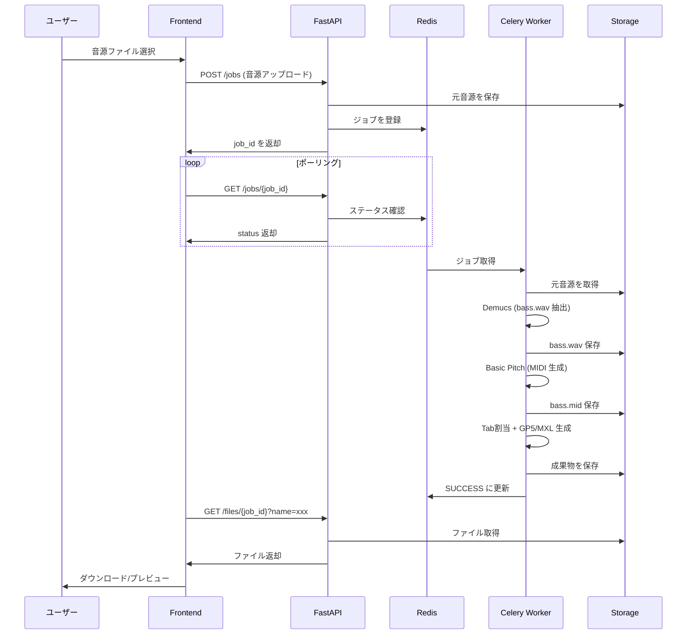

# データフロー

## パイプライン概要

音源ファイルのアップロードから成果物のダウンロードまでの一連の流れを示します。



## 各ステップの詳細

### 1. アップロード (Upload)

- **エンドポイント**: `POST /jobs`
- **入力形式**: `mp3`, `m4a`, `wav`, `ogg`, `flac` (librosa 互換)
- **バリデーション**:
  - ファイルサイズ: 50MB 以下 (推奨)
  - 曲の長さ: 10分以下 (推奨)
- **保存先**: `/data/{job_id}/{original_filename}`

### 2. 音源分離 (Separation - Demucs)

- **モデル**: `htdemucs` (Hybrid Transformer Demucs v4)
- **入力**: 元音源
- **出力**: `/data/{job_id}/{stem_dir}/bass.wav`
- **備考**: drums, vocals, other も出力されるが、bass のみ後続処理に使用
- **周波数**: 22kHz (フルレンジ保持)

### 3. MIDI変換 (Transcription - Basic Pitch)

- **入力**: `bass.wav`
- **出力**: `/data/{job_id}/out/bass.mid`
- **前処理**: Basic Pitch が内部でモノラル化 + 22,050Hz リサンプリングを行うため、手動の前処理は不要
- **推論**: CPU/GPU 両対応 (GPU 推奨)

### 4. Tab割当 (Tab Assignment - PyGuitarPro)

- **入力**: `bass.mid`
- **出力**:
  - `/data/{job_id}/out/{basename}.gp5` (Guitar Pro 5)
  - `/data/{job_id}/out/{basename}.musicxml` (MusicXML - Phase 2)
- **チューニング**: 標準4弦ベース (E1, A1, D2, G2)
- **アルゴリズム**: (Phase 1) 単純割当 → (Phase 2) DP運指最適化

### 5. 成果物配信 (Serving)

- **エンドポイント**: `GET /files/{job_id}?name={filename}`
- **配信対象**:
  - `bass.wav` (分離済みベース音源)
  - `bass.mid` (MIDI)
  - `{basename}.gp5` (Guitar Pro)
  - `{basename}.musicxml` (MusicXML - Phase 2)

## ディレクトリ構造

```
/data/
└── {job_id}/
    ├── original.mp3          # 元音源
    ├── htdemucs/             # Demucs 出力
    │   ├── bass.wav
    │   ├── drums.wav
    │   ├── vocals.wav
    │   └── other.wav
    └── out/                  # 最終成果物
        ├── bass.mid
        ├── bass.gp5
        └── bass.musicxml     # Phase 2
```

## ジョブのステータス管理

| ステータス | 説明 |
|:---|:---|
| `PENDING` | ジョブがキューに登録済み、未開始 |
| `STARTED` | ワーカーが処理を開始 |
| `SUCCESS` | 正常完了、成果物あり |
| `FAILURE` | エラー終了、`error` フィールドに詳細 |
| `RETRY` | リトライ中 (Phase 3) |

## タイムアウトとポーリング

| 項目 | 推奨値 |
|:---|:---|
| ポーリング間隔 | 1.5 〜 3 秒 |
| タイムアウト上限 (CPU) | 15 〜 20 分 |
| タイムアウト上限 (GPU) | 5 分 |

## エラーハンドリング

- Demucs/Basic Pitch の例外は Celery の `FAILURE` ステータスに反映される。
- API は `error` フィールドにエラー内容を格納して返却。
- 途中生成物はデバッグ用に残置。運用時はクリーンアップジョブで整理。
