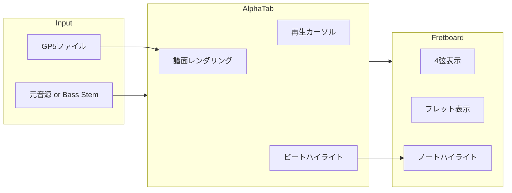

# 演奏デモモード機能仕様

## 概要

生成されたTab譜と元音源（またはベースstem）を同期再生し、現在演奏位置をTab譜とフレットボード上でリアルタイムにハイライト表示する機能。

## ユーザーストーリー

> ベーシストとして、生成されたTab譜を音楽に合わせて練習できるデモモードが欲しい。
> Tab譜上で現在の演奏位置が光り、フレットボード上でどの弦のどのフレットを押さえればいいかが視覚的にわかると嬉しい。

## 機能要件

### 1. Tab譜同期再生



### 2. UI コンポーネント

| コンポーネント | 説明 |
|:---|:---|
| **Tab譜ビューア** | AlphaTab による譜面表示、再生カーソル付き |
| **フレットボード** | 4弦ベースの簡易フレットボード（0-12フレット） |
| **コントロールバー** | 再生/一時停止、シーク、速度調整 |
| **オーディオ切替** | 元音源 / Bass Stem の切り替え |

### 3. 画面レイアウト

```
+------------------------------------------+
|           コントロールバー                 |
| [▶️ 再生] [⏸️ 一時停止] [🔊 音量] [⏱️ 速度] |
+------------------------------------------+
|                                          |
|              Tab譜ビューア                |
|     (スクロール、カーソル追従)             |
|                                          |
+------------------------------------------+
|              フレットボード               |
|  E |---|---|---|---|---|---| ...        |
|  A |---|---|---|---|---|---| ...        |
|  D |---|---|---|---|---|---| ...        |
|  G |---|---|---|---|---|---| ...        |
|     0   1   2   3   4   5               |
+------------------------------------------+
```

## 技術仕様

### AlphaTab 連携

AlphaTab は以下の機能を提供しており、演奏デモモードに活用できる。

#### 再生カーソル設定

```typescript
const api = new alphaTab.AlphaTabApi(element, {
  file: '/path/to/score.gp5',
  player: {
    enablePlayer: true,
    enableCursor: true,           // カーソル表示
    enableElementHighlighting: true, // ノートハイライト
    soundFont: '/soundfonts/sonivox.sf2'
  }
});
```

#### CSS カスタマイズ

```css
/* バーカーソル（現在の小節） */
.at-cursor-bar {
  background: rgba(255, 191, 0, 0.2);
}

/* ビートカーソル（現在のビート） */
.at-cursor-beat {
  background: rgba(64, 64, 255, 0.75);
  width: 3px;
}

/* ハイライト（演奏中のノート） */
.at-highlight {
  fill: #0d6efd !important;
  stroke: #0d6efd !important;
}
```

#### イベントリスナー

```typescript
// 現在演奏中のビートが変わったとき
api.activeBeatsChanged.on((args) => {
  const activeBeat = args.activeBeats[0];
  if (activeBeat) {
    updateFretboard(activeBeat.notes);
  }
});

// 再生位置の変化
api.playerPositionChanged.on((args) => {
  updateProgressBar(args.currentTime, args.endTime);
});
```

### フレットボード実装

#### データ構造

```typescript
interface FretboardNote {
  string: number;  // 1-4 (4弦ベース)
  fret: number;    // 0-24
  isActive: boolean;
}

interface FretboardState {
  notes: FretboardNote[];
  tuning: number[]; // [40, 45, 50, 55] = E1, A1, D2, G2
}
```

#### React コンポーネント

```tsx
// components/Fretboard.tsx
interface FretboardProps {
  activeNotes: FretboardNote[];
  strings: number;  // 4 or 5
  frets: number;    // 表示するフレット数
}

function Fretboard({ activeNotes, strings = 4, frets = 12 }: FretboardProps) {
  return (
    <div className="fretboard">
      {Array.from({ length: strings }, (_, stringIdx) => (
        <div key={stringIdx} className="string-row">
          {Array.from({ length: frets + 1 }, (_, fretIdx) => (
            <div
              key={fretIdx}
              className={classNames('fret', {
                'active': activeNotes.some(
                  n => n.string === stringIdx + 1 && n.fret === fretIdx
                )
              })}
            >
              {fretIdx === 0 ? '○' : ''}
            </div>
          ))}
        </div>
      ))}
    </div>
  );
}
```

#### アニメーション

```css
.fret.active {
  background: radial-gradient(circle, #00ff88 0%, #00aa55 100%);
  box-shadow: 0 0 10px #00ff88, 0 0 20px #00ff88;
  animation: pulse 0.3s ease-in-out;
}

@keyframes pulse {
  0% { transform: scale(1); }
  50% { transform: scale(1.2); }
  100% { transform: scale(1); }
}
```

### 音声同期

#### オプション1: AlphaTab 内蔵シンセ

- GP5 の MIDI データを AlphaSynth で再生
- 元音源との同期は不要
- 音質は SoundFont に依存

#### オプション2: 元音源同期

- Web Audio API で元音源を再生
- AlphaTab の `playerPositionChanged` と同期
- より本格的な練習体験

```typescript
// 元音源との同期
const audioContext = new AudioContext();
let audioBuffer: AudioBuffer;

api.playerStateChanged.on((args) => {
  if (args.state === alphaTab.PlayerState.Playing) {
    playOriginalAudio(api.tickPosition);
  }
});
```

## 実装フェーズ

### Phase 1: 基本機能

- [ ] AlphaTab プレイヤー統合
- [ ] 再生カーソル表示
- [ ] ビートハイライト
- [ ] コントロールバー（再生/停止）

### Phase 2: フレットボード

- [ ] 4弦フレットボードコンポーネント
- [ ] `activeBeatsChanged` イベント連携
- [ ] ノートハイライトアニメーション

### Phase 3: 高度な機能

- [ ] 再生速度調整 (0.5x-2.0x)
- [ ] ループ再生（A-B間リピート）
- [ ] 元音源/Stem切り替え
- [ ] 5弦/6弦ベース対応

## API 変更

### 新規エンドポイント

なし（既存の `/files/{job_id}` で GP5 と音源を取得）

### フロントエンドルート

| パス | 説明 |
|:---|:---|
| `/demo/{job_id}` | 演奏デモモード画面 |

## 依存関係

既存の依存関係で実装可能。追加パッケージ不要。

| 機能 | 使用技術 |
|:---|:---|
| Tab譜表示/再生 | AlphaTab (既存) |
| フレットボード | React + CSS (自作) |
| 音声同期 | Web Audio API (ブラウザ標準) |

## パフォーマンス考慮

- `activeBeatsChanged` イベントは高頻度で発火するため、フレットボード更新は requestAnimationFrame でスロットリング
- 長い曲の場合、AlphaTab のレンダリングは遅延読み込み（無限スクロール）を検討
