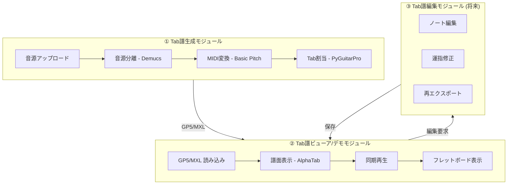
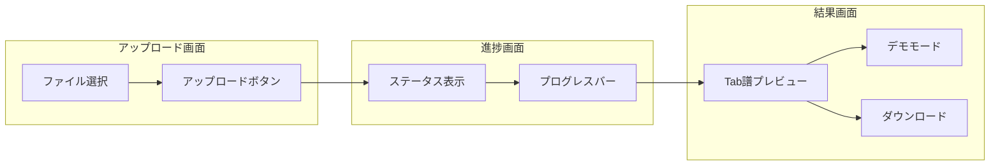

# 機能仕様

## アプリケーション構成

本アプリケーションは以下の **3つの独立したモジュール** で構成されます。
各モジュールは疎結合であり、単独でも動作可能です。

> [!IMPORTANT]
> **モジュール分離の原則**
>
> - **① Tab譜生成**: バックエンド (Celery Worker) で動作。音源が必須。
> - **② Tab譜ビューア/デモ**: フロントエンドのみで動作。GP5/MXL ファイルがあれば動作。
> - **③ Tab譜編集**: フロントエンドのみで動作。ビューアの拡張として実装。
>
> これにより、既存の GP5 ファイルをアップロードしてデモモードで再生することも可能。

---

## コア機能

| 機能 | エンドポイント/画面 | モジュール | 説明 |
|:---|:---|:---|:---|
| 音源アップロード | `POST /jobs` | ① 生成 | 音源ファイルを受け取り、ジョブIDを返却（mp3/wav/m4a/ogg/flac/opus、50MBまで） |
| ジョブ進捗確認 | `GET /jobs/{id}` | ① 生成 | ステータスと成果物一覧を取得 |
| 成果物ダウンロード | `GET /files/{id}?name=...` | ① 生成 | MIDI, GP5, 分離済み音源をダウンロード |
| Tab譜プレビュー | Frontend | ② ビューア | GP5/MusicXML を描画・再生 |
| 演奏デモモード | Frontend | ② ビューア | 同期再生、フレットボード表示 |
| Tab譜編集 | Frontend | ③ 編集 | ノート編集、再エクスポート (将来) |

---

## フロントエンド画面

---

## 非機能要件

| カテゴリ | 要件 |
|:---|:---|
| **パフォーマンス** | 4分の曲を CPU で 15分以内、GPU で 5分以内に処理 |
| **スケーラビリティ** | Celery ワーカーの水平スケールで同時処理数を調整可能 |
| **可用性** | Redis障害時はジョブ状態がロストする (Phase 1) |
| **ストレージ** | ローカル `/data` をデフォルト、S3 はオプション |
| **ロギング** | `job_id` 付きの構造化ログ、処理時間の計測 |

---

## 進捗スナップショット (2025-12)

- [x] API スタブ (`/api/v1/jobs` POST/GET) と Celery worker スタブを実装し、ジョブID返却とステータス確認が可能
- [x] Demucs モデルはオンデマンドDLし、`/data/cache/demucs` にキャッシュ (compose でボリューム共有)
- [x] GPU/CPU 両対応の docker-compose ひな型を用意し、バックエンドコードとテストをマウントして即時反映
- [x] フロントエンドはアップロード + ポーリングのモック UI (AlphaTab プレースホルダ) を提供
- [x] Audio→MIDI (Basic Pitch ONNX) を実装し、ONNX GPU ランタイムで動作確認済み（`onnxruntime-gpu`、合成トーンでMIDI生成テスト）。

---

## Phase 別ロードマップ

### Phase 1: MVP

**① Tab譜生成モジュール**
- [x] 音源アップロード API (`POST /jobs`)
- [x] ジョブ進捗確認 API (`GET /jobs/{id}`)
- [x] 成果物ダウンロード API (`GET /files/{id}`)
- [x] Demucs によるベース抽出
- [x] Basic Pitch (ONNX) による MIDI 生成（GPU/CPU両対応）
- [x] 簡易 Tab 割当 (最低弦割当)
- [x] GP5 出力 (PyGuitarPro)
- [x] ローカルストレージ (`/data`)

**② Tab譜ビューア/デモモジュール**
- [ ] AlphaTab による GP5 プレビュー
- [ ] **演奏デモモード** (詳細: [DEMO_MODE.md](DEMO_MODE.md))
    - [ ] Tab譜同期再生 (カーソル追従)
    - [ ] フレットボード表示 (ノートハイライト)
    - [ ] コントロールバー (再生/停止)

---

### Phase 2: 機能拡張

**① Tab譜生成モジュール**
- [ ] MusicXML 出力の追加 (music21)
- [ ] Tab 割当アルゴリズムの高度化 (DP運指最適化、和音対応)
- [ ] 5弦/6弦ベース、ドロップチューニングのサポート

**② Tab譜ビューア/デモモジュール**
- [ ] 再生速度調整 (0.5x-2.0x)
- [ ] ループ再生 (A-B間リピート)
- [ ] 元音源/Stem切り替え

**③ Tab譜編集モジュール**
- [ ] ノート選択・編集
- [ ] 運指修正
- [ ] GP5/MXL 再エクスポート

---

### Phase 3: 運用強化

- [ ] ジョブキャンセル API
- [ ] リトライポリシーの実装
- [ ] S3 ストレージオプション
- [ ] 期限付き URL (Presigned URL)
- [ ] クリーンアップジョブ (古いジョブの自動削除)
- [ ] 監視・メトリクス (Prometheus/Grafana)

---

### 将来構想

- [ ] ギターTab対応
- [ ] 複数トラック (ベース + ドラム) の同時処理
- [ ] ユーザー認証とジョブ履歴管理
- [ ] コミュニティ機能 (Tab共有)
