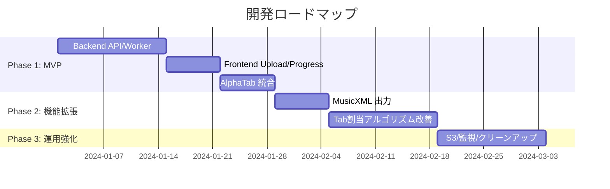

# 実装計画

## 実装フェーズ



## 依存関係と環境

### パッケージマネージャ

**`uv`** を使用して依存関係を管理します。

```bash
# プロジェクト初期化
uv init

# 依存関係のインストール
uv sync

# lockfileの生成
uv lock
```

### Python 依存関係

```toml
# backend/pyproject.toml
[project]
name = "stem2tab"
version = "0.1.0"
requires-python = ">=3.11"
dependencies = [
    "fastapi>=0.109.0",
    "uvicorn[standard]>=0.27.0",
    "celery[redis]>=5.3.0",
    "redis>=5.0.0",
    "demucs>=4.0.0",
    "pyguitarpro>=0.10.0",
    "music21>=9.0.0",
    "librosa>=0.10.0",
    "soundfile>=0.12.0",
    "onnxruntime>=1.19.2",
    "pydantic>=2.0.0",
    "pydantic-settings>=2.0.0",
    "structlog>=24.1.0",
]

[tool.uv]
dev-dependencies = ["pytest>=8.0.0", "pytest-asyncio>=0.23.0", "httpx>=0.27.0"]
```

### システム依存関係 (Dockerfile)

```dockerfile
RUN apt-get update && apt-get install -y --no-install-recommends \
    ffmpeg \
    libsndfile1 \
    && rm -rf /var/lib/apt/lists/*
```

### Frontend 依存関係

```json
{
  "dependencies": {
    "react": "^18.2.0",
    "react-dom": "^18.2.0",
    "@coderline/alphatab": "^1.3.0"
  },
  "devDependencies": {
    "typescript": "^5.3.0",
    "vite": "^7.2.6",
    "@vitejs/plugin-react": "^5.1.1",
    "vitest": "^4.0.15"
  }
}
```

## 環境変数

| 変数名 | 説明 | 必須 | デフォルト |
|:---|:---|:---|:---|
| `FILE_BUCKET_PATH` | 成果物の保存先ディレクトリ | Yes | `/data` |
| `CELERY_BROKER_URL` | Redis ブローカーURL | Yes | `redis://redis:6379/0` |
| `DEMUCS_MODEL` | Demucsモデル名 | No | `htdemucs` |
| `API_PORT` | APIの待受ポート | No | `8000` |
| `WEB_PORT` | web preview の待受ポート | No | `4173` |
| `LOG_LEVEL` | ログレベル | No | `info` |
| `DEMUCS_CACHE_SUBDIR` | Demucsモデルキャッシュ相対パス (`FILE_BUCKET_PATH` 配下) | No | `cache/demucs` |

- `FILE_BUCKET_PATH` の `/data` はコンテナ内パス。変更したい場合は、`docker-compose*.yml` のボリュームマウント先と合わせて設定すること（例: `FILE_BUCKET_PATH=/workspace/data` とし、compose 側も `/workspace/data` をマウントする）。

### モデル取得ポリシー

- Demucs は **起動時オンデマンドDL**。未取得の場合のみ `DEMUCS_CACHEDIR`（デフォルト `/data/cache/demucs`）にダウンロードし、ボリュームで永続化。

## CPU/GPU ポリシー

| 環境 | 設定 | 備考 |
|:---|:---|:---|
| GPU (標準) | `deploy.resources.devices` で `nvidia` 指定 | ホストに NVIDIA Container Toolkit が必要 |
| CPU (フォールバック) | GPU設定なし | 動作は遅いが必ず動作する |

```yaml
# docker-compose.yml (GPU有効時)
worker:
  deploy:
    resources:
      reservations:
        devices:
          - driver: nvidia
            count: 1
            capabilities: [gpu]
```

- GPU 版: `docker-compose.yml` / CPU 版: `docker-compose.cpu.yml` を用意。`./data:/data` を共有し、API/worker が同一キャッシュを再利用。

## ストレージポリシー

### ローカルストレージ (Phase 1)

- 保存先: `/data/{job_id}/`
- ボリュームマウント: `./data:/data`

### S3 ストレージ (Phase 3)

- キー構造: `{job_id}/out/{filename}`
- Presigned URL で期限付き配信

## ロギングと監視

### 構造化ログ

```python
import structlog

logger = structlog.get_logger()
logger.info("job_started", job_id=job_id, input_file=filename)
logger.info("demucs_complete", job_id=job_id, duration_sec=elapsed)
```

### メトリクス (Phase 3)

- キュー長
- 処理時間分布 (p50, p95, p99)
- エラー率
- GPU 利用率

## 実装順序

1. **依存関係の整備**
   - `uv` で `pyproject.toml` と `uv.lock` を作成
   - Dockerfile を `uv sync` ベースに変更

2. **API ステータス拡張**
   - `PENDING`, `STARTED`, `RETRY`, `FAILURE`, `SUCCESS`
   - `error` フィールドの追加

3. **Tab割当ロジック実装**
   - Phase 1: 最低弦への単純割当
   - Phase 2: DP による運指コスト最小化

4. **MusicXML 出力追加**
   - `music21` または手動 XML 生成

5. **フロントエンド改善**
   - エラー表示
   - ポーリング停止条件
   - 再アップロード導線

6. **S3 オプション**
   - `boto3` による S3 アップロード
   - Presigned URL 生成

7. **監視とクリーンアップ**
   - Prometheus メトリクスエンドポイント
   - 古いジョブの定期削除
