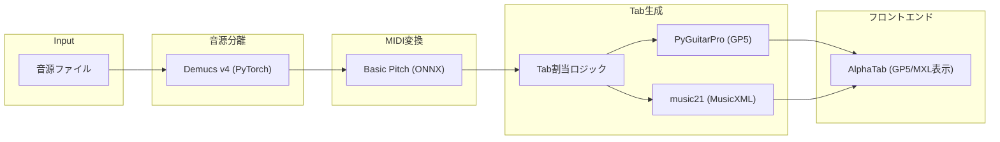

# 技術スタック調査レポート

## 調査日

2025-12-07

## 調査対象

| ライブラリ | 現在の方針 | 調査結果 |
|:---|:---|:---|
| Spleeter | 音源分離に使用 | ⚠️ 要見直し |
| Basic Pitch | Audio-to-MIDI に使用 | ✅ 問題なし |
| PyGuitarPro | GP5出力に使用 | ⚠️ 制限あり |
| AlphaTab | 譜面表示に使用 | ✅ 問題なし |
| React + Vite | フロントエンドに使用 | ✅ 問題なし |

---

## 1. Spleeter

### 現状

- **最終更新**: 2023年頃から開発停滞
- **TensorFlow依存**: 特定のTFバージョン（2.3～2.5）に依存
- **Python互換性**: Python 3.11+ で問題発生の報告あり

### 問題点

> [!CAUTION]
> **Spleeterの開発は停滞しており、TensorFlowの依存関係が問題を引き起こす可能性が高い。**
>
> - Python 3.11 + TensorFlow 2.15 の組み合わせで動作させるには、spleeter-web などのフォーク版が必要
> - Apple M1/M2 チップで動作に問題あり
> - 周波数上限が 11-16kHz で高域が欠落する

### 推奨アクション

> [!IMPORTANT]
> **Demucs への移行を強く推奨**
>
> | 項目 | Spleeter | Demucs (v4) |
> |:---|:---|:---|
> | 分離品質 | 普通 | 高品質 |
> | 周波数範囲 | 11-16kHz | 22kHz (フル) |
> | 開発状況 | 停滞 | 活発 (Meta) |
> | フレームワーク | TensorFlow | PyTorch |
> | 速度 | 速い | やや遅い |
>
> Demucs v4 (Hybrid Transformer) は現時点で最高品質の音源分離を提供。
> PyTorch ベースのため、Basic Pitch (ONNX) との依存競合も回避可能。

---

## 2. Basic Pitch

### 現状

- **最新バージョン**: v0.3.1 (2024年8月)
- **開発状況**: Spotify が活発にメンテナンス中
- **ランタイム**: TensorFlow, CoreML, TFLite, **ONNX** から自動選択

### 良い点

✅ **ONNX バックエンドを使用すれば TensorFlow 不要**

```bash
# ONNX バックエンド（TF不要、軽量）
pip install basic-pitch
```

✅ モノラル化・22050Hz リサンプリングは内部で自動処理

✅ ピッチベンド検出対応

### 推奨アクション

- 現在の方針で問題なし
- **ONNX バックエンドをデフォルトで使用**（TF依存を排除）

---

## 3. PyGuitarPro

### 現状

- **最新バージョン**: v0.10.1 (2025年11月)
- **対応フォーマット**: **GP3, GP4, GP5 のみ**
- **非対応**: GP6 (.gpx), GP7 (.gp)

### 問題点

> [!WARNING]
> **Guitar Pro 6/7 形式 (.gpx, .gp) は非対応**
>
> PyGuitarPro は明確に GP6 対応はスコープ外と表明している。

### 回避策

AlphaTab は GP7 (.gp) の読み込み・エクスポートに対応しているため：

1. **バックエンド**: PyGuitarPro で **GP5 (.gp5)** を出力
2. **フロントエンド**: AlphaTab で GP5 を読み込み → 必要なら GP7 にエクスポート

### 推奨アクション

- GP5 をプライマリ出力フォーマットとして維持（PyGuitarPro で生成）
- ユーザーが GP7 を必要とする場合は、フロントエンド側で変換オプションを提供

---

## 4. AlphaTab

### 現状

- **最新バージョン**: v1.3.x
- **対応フォーマット**: GP3, GP4, GP5, **GP6, GP7**, MusicXML
- **React統合**: 公式コンポーネントなし、Ref経由で手動統合

### 良い点

✅ **GP7 (.gp) の読み込み・エクスポート対応** (v1.2.0+)

✅ 内蔵シンセ (AlphaSynth) でMIDI再生可能

✅ Vite/Webpack 用プラグイン提供

### 注意点

> [!NOTE]
> **SoundFont ファイル (SF2) が必須**
>
> 再生機能を使用するには SoundFont を `public/` に配置する必要がある。
> 無料の SONiVOX SoundFont がバンドルされている。

### 推奨アクション

- 現在の方針で問題なし
- Vite プラグイン (`@coderline/alphatab/vite`) を使用
- SoundFont は CDN または public/ から配信

---

## 5. MusicXML 出力 (追加検討)

### 推奨ライブラリ

**music21** を使用

- **最新バージョン**: v9.9.1 (2025年10月)
- **Python互換性**: 3.10+ (3.11, 3.12, 3.13, 3.14)
- **機能**: MusicXML 読み書き、楽譜解析・変換

```python
from music21 import stream, note

score = stream.Score()
# ... 楽譜を構築 ...
score.write('musicxml', fp='output.xml')
```

### 推奨アクション

- MusicXML 出力には **music21** を採用
- PyGuitarPro (GP5) と music21 (MusicXML) の両方を出力

---

## 改訂版アーキテクチャ



---

## まとめ

| 項目 | 現在の方針 | 推奨変更 |
|:---|:---|:---|
| 音源分離 | Spleeter | **Demucs v4 に変更** |
| Audio-to-MIDI | Basic Pitch | 維持 (ONNX バックエンド) |
| Tab出力 | PyGuitarPro (GP5) | 維持 |
| MusicXML出力 | 未定 | **music21 を採用** |
| フロントエンド | AlphaTab | 維持 |

### 依存関係の競合回避

| ライブラリ | フレームワーク |
|:---|:---|
| Demucs | PyTorch |
| Basic Pitch | ONNX (TF不要) |
| music21 | 純粋Python |

**TensorFlow 依存を完全に排除** することで、依存関係の競合リスクを大幅に低減。
