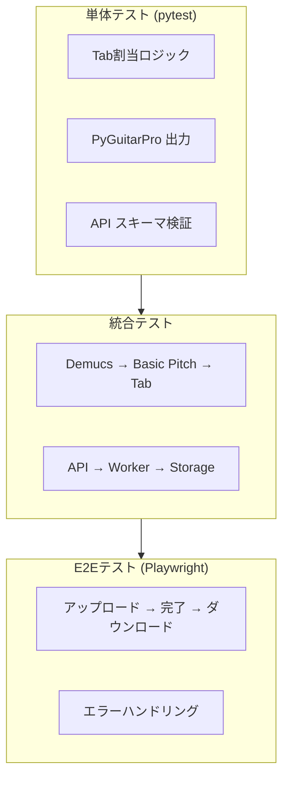

# テスト計画

## テスト戦略



## 単体テスト (pytest)

前提: `basic-pitch` は TensorFlow を引き込まないために **手動で no-deps インストール**する。

```bash
cd backend
uv sync --locked --dev
uv pip install --no-deps basic-pitch==0.4.0
```

### テスト対象

| モジュール | テスト内容 |
|:---|:---|
| `pipelines.separation` | Demucs ラッパーの入出力パス生成、例外伝搬 |
| `pipelines.transcription` | Basic Pitch ラッパーの MIDI 出力検証 |
| `logic.tab_assignment` | 弦/フレット決定ロジック、運指コスト計算 |
| `logic.gp_writer` | GP5 書き出し → 再読込で弦/フレット一致 |
| `api.schemas` | Pydantic スキーマのバリデーション |

### テスト例

```python
# tests/test_tab_assignment.py
import pytest
from logic.tab_assignment import assign_fret

def test_open_string_e1():
    """E1 (MIDI 28) は4弦開放"""
    string, fret = assign_fret(midi_note=28, tuning=[28, 33, 38, 43])
    assert string == 4
    assert fret == 0

def test_high_note_g3():
    """G3 (MIDI 55) は1弦12フレット"""
    string, fret = assign_fret(midi_note=55, tuning=[28, 33, 38, 43])
    assert string == 1
    assert fret == 12
```

## 統合テスト

### パイプライン統合

```python
# tests/integration/test_pipeline.py
import pytest
from pathlib import Path

def test_full_pipeline(tmp_path: Path, sample_audio: Path):
    """Demucs → Basic Pitch → Tab 割当の統合テスト"""
    from pipelines.separation import separate_bass
    from pipelines.transcription import transcribe_midi
    from logic.tab_assignment import generate_gp5

    # 1. 音源分離
    bass_wav = separate_bass(sample_audio, tmp_path)
    assert bass_wav.exists()

    # 2. MIDI変換
    midi_file = transcribe_midi(bass_wav, tmp_path)
    assert midi_file.exists()

    # 3. GP5生成
    gp5_file = generate_gp5(midi_file, tmp_path)
    assert gp5_file.exists()
```

### Transcription ONNX スモーク

```bash
cd backend
uv sync --locked --dev
uv pip install --no-deps basic-pitch==0.4.0
BASIC_PITCH_MODEL_SERIALIZATION=onnx uv run pytest tests/integration/test_transcription.py -q
```

### API 統合

```python
# tests/integration/test_api.py
import pytest
from httpx import AsyncClient

@pytest.mark.asyncio
async def test_job_lifecycle(client: AsyncClient, sample_audio: bytes):
    # ジョブ作成
    response = await client.post(
        "/jobs",
        files={"file": ("test.mp3", sample_audio, "audio/mpeg")}
    )
    assert response.status_code == 202
    job_id = response.json()["job_id"]

    # ステータス確認 (ポーリング)
    for _ in range(60):
        status = await client.get(f"/jobs/{job_id}")
        if status.json()["status"] in ("SUCCESS", "FAILURE"):
            break
        await asyncio.sleep(1)

    assert status.json()["status"] == "SUCCESS"
```

## スモーク (API/Worker)

- 目的: API と Celery ワーカーの起動・疎通を最小限で確認する。
- 内容: Demucs ダウンロードはモックし、ジョブ作成 → ステータス取得のフローのみ確認。Basic Pitch は ONNX モデルを no-deps で導入。

### 手順 (ホストで実行)

```bash
cd backend
uv sync --locked --dev
uv pip install --no-deps basic-pitch==0.4.0
uv run pytest tests/integration/test_smoke_pipeline.py -q
```

### 手順 (Docker Compose 内で実行)

```bash
# GPU 版（事前に api イメージへ basic-pitch を no-deps でインストール済み）
docker compose run --rm api uv run pytest tests/integration/test_smoke_pipeline.py -q
# CPU 版
docker compose -f docker-compose.cpu.yml run --rm api uv run pytest tests/integration/test_smoke_pipeline.py -q
```

## ヘルスチェック

- API の liveness: `curl -f http://localhost:${API_PORT:-8000}/health`
- コンテナ内から確認する場合:

```bash
docker compose exec api curl -f http://localhost:8000/health
```

200 が返れば FastAPI が起動し、Redis への依存が満たされていることを示す。

## E2E テスト (Playwright)

### テストシナリオ

| シナリオ | 手順 | 期待結果 |
|:---|:---|:---|
| 正常系 | アップロード → 待機 → プレビュー → ダウンロード | GP5 がダウンロードされ、AlphaTab で表示される |
| エラー系 | 不正なファイルをアップロード | エラーメッセージが表示され、ポーリングが停止 |
| キャンセル系 | アップロード後にキャンセル (Phase 3) | ジョブがキャンセルされ、リソースが解放される |

### テスト例

```typescript
// tests/e2e/upload.spec.ts
import { test, expect } from '@playwright/test';

test('upload and download bass tab', async ({ page }) => {
  await page.goto('/');

  // ファイルアップロード
  const fileInput = page.locator('input[type="file"]');
  await fileInput.setInputFiles('./fixtures/sample.mp3');
  await page.click('button:has-text("Upload")');

  // 進捗待機
  await expect(page.locator('[data-testid="status"]'))
    .toHaveText('SUCCESS', { timeout: 300000 });

  // ダウンロード確認
  const [download] = await Promise.all([
    page.waitForEvent('download'),
    page.click('a:has-text("Download")')
  ]);
  expect(download.suggestedFilename()).toMatch(/\.gp5$/);
});
```

## パフォーマンステスト

### SLO (Service Level Objectives)

| 曲の長さ | CPU | GPU |
|:---|:---|:---|
| 2分 | < 8分 | < 2分 |
| 4分 | < 15分 | < 5分 |
| 6分 | < 20分 | < 8分 |

### ベンチマーク

```bash
# パフォーマンス計測スクリプト
hyperfine \
  --warmup 1 \
  --runs 3 \
  'python -m pipelines.run_benchmark fixtures/4min_song.mp3'
```

## テストデータ

### フィクスチャ

| ファイル | 説明 |
|:---|:---|
| `fixtures/sample_10sec.mp3` | 10秒のベースライン入り音源 (CI用) |
| `fixtures/sample_4min.mp3` | 4分の実曲 (パフォーマンステスト用) |
| `fixtures/expected_bass.mid` | 期待 MIDI 出力 (ゴールデンデータ) |
| `fixtures/expected_bass.gp5` | 期待 GP5 出力 (ゴールデンデータ) |

### モデルキャッシュ

- CI では事前にモデルをダウンロードし、キャッシュとしてマウント。
- オフラインテスト用にモック/スタブを用意。

## CI/CD 統合

```yaml
# .github/workflows/test.yml
name: Test
on: [push, pull_request]

jobs:
  test:
    runs-on: ubuntu-latest
    steps:
      - uses: actions/checkout@v4

      - name: Install uv
    uses: astral-sh/setup-uv@v4

      - name: Install dependencies
    run: uv sync --locked --dev

  - name: Install Basic Pitch (ONNX only)
    run: uv pip install --no-deps basic-pitch==0.4.0

      - name: Run unit tests
    env:
      BASIC_PITCH_MODEL_SERIALIZATION: onnx
    run: uv run pytest tests/unit -v

      - name: Run integration tests
    env:
      BASIC_PITCH_MODEL_SERIALIZATION: onnx
    run: uv run pytest tests/integration -v

  e2e:
    runs-on: ubuntu-latest
    needs: test
    steps:
      - uses: actions/checkout@v4
      - name: Start services
        run: docker compose up -d
      - name: Run Playwright tests
        run: npx playwright test
```

## 補助スクリプト

ルートの `Makefile` でよく使うタスクをまとめています。

```bash
# GPU compose 起動
make dev-gpu
# CPU compose 起動
make dev-cpu
# backend テスト (Basic Pitch ONNX no-deps 導入込み)
make test-backend
# frontend テスト＋ビルド
make test-frontend
```
